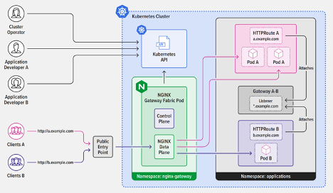
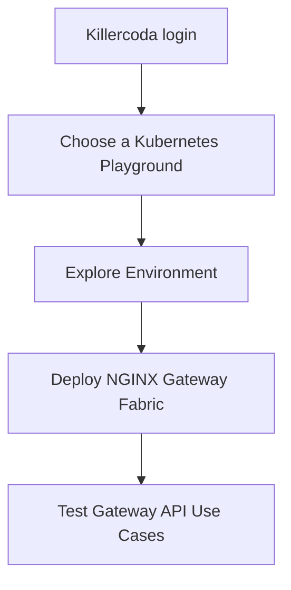
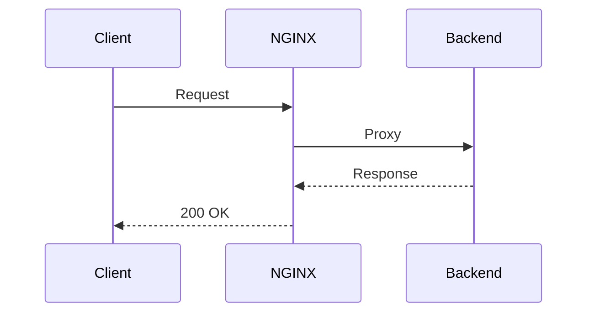
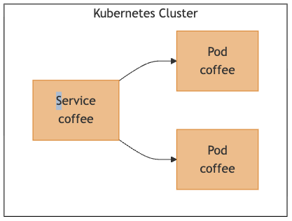

# NGF-master

In this Lab, you will learn about the Kubernetes Gateway API and it's setup and configuration in a Kubernetes cluster.

By the end of this guide, you will have learned:  
    ✔ What the Kubernetes Gateway API is  
    ✔ Key concepts of the Gateway API  
    ✔ Practical implementation of Gateway API controllers with NGINX Gateway Fabric  
    ✔ How to use Gateway API objects like GatewayClass, Gateway, HTTPRoute etc.
    ✔ How to implement path-based routing using the Gateway API and more.  

Let's get started!

## Introduction
### The Gateway API is a paradigm shift in Kubernetes traffic management.
Kubernetes has become the foundation for cloud-native applications. However, managing and routing traffic within clusters remains a challenging issue. The traditional Ingress resource, though helpful in exposing services, has shown limitations. Its loosely defined specifications often cause controller-specific behaviors, complicated annotations, and hinder portability across different environments. These challenges become even more apparent as organizations scale their microservices architectures. Ingress was designed primarily for basic service exposure and routing. While it can be extended with annotations or custom controllers, it lacks first-class support for advanced deployment patterns such as canary or blue-green releases. This forces teams to rely on add-ons or vendor-specific features, which adds complexity and reduces portability.

To overcome the limitations of traditional ingress controllers better, the Kubernetes community has introduced the Gateway API. This is a new, forward-looking, standards-based approach to service networking. Unlike the more rigid Ingress, the Gateway API provides greater flexibility, role-specific functionalities, and a comprehensive set of features. It encourages collaboration among platform engineers, developers, and security teams by supporting advanced capabilities such as TLS offloading, traffic splitting, and smooth integration with service meshes.

```mermaid
In Ingress controllers, we define routing rules in the Ingress object. The Ingress Controller handles the actual routing. The same concept applies to the Gateway API.

While the Gateway API provides many objects to manage cluster traffic, the actual routing is done by a Gateway API Controller. This controller is NOT built-in into Kubernetes. We need to install the controller, just like with Ingress case.
```

Shortcuts: 
[🚀 Deploy](#installation)
⚙️ [Config](#test-gateway-use-cases)
🧪 [Testing](#test-gateway-use-cases)
[🧵 Monitoring](https://docs.nginx.com/nginx-gateway-fabric/monitoring/)
[🔧 Troubleshooting](https://docs.nginx.com/nginx-gateway-fabric/troubleshooting/)
[📘 Docs](docs.nginx.com)


## NGINX Gateway Fabric - F5 NGINX Implementaion of Gateway API
NGINX Gateway Fabric provides an implementation of the Gateway API using NGINX as the data plane. The goal of the project is to implement the core Gateway APIs needed to configure an HTTP or TCP/UDP load balancer, reverse proxy, or API gateway for Kubernetes applications.

Built on the Gateway API standard, NGINX Gateway Fabric offers a production-ready solution. It combines the robustness and performance of NGINX with the extensibility of this new standard. It provides consistent traffic management, observability, and security across Kubernetes clusters. Additionally, its integration with NGINX One Console enables centralized control and monitoring in distributed environments.

For a list of supported Gateway API resources and features, see the [Gateway API Compatibility](https://docs.nginx.com/nginx-gateway-fabric/overview/gateway-api-compatibility/) documentation.
---
### Design
---

In Nginx Gateway Fabric, two types of controllers.
- **Control Plane Controller**
- **Data Plane Controller**

NGINX Gateway Fabric separates the control plane and data plane into distinct deployments. The control plane interacts with the Kubernetes API, watching for Gateway API resources.

**Control Plane Controller**
- When we install the Nginx Gateway Fabric on Kubernetes, the Control plane controller will be deployed.

- The job of this controller is to watch its custom resources, such as Gateway, HTTPRoute, TLSRoute, etc.

- When we create a custom resource, the control plane controller will get the required resources and create the object.

**Date Plane Controller**
- When we create a Gateway Custom Resource, the control plane controller will dynamically create a Data plane controller with the given information on the Gateway.

- The data plane controller actually routes the traffic to the specific services.



When a new Gateway resource is provisioned, it dynamically creates and manages a corresponding NGINX data plane Deployment and Service.

Each NGINX data plane pod consists of an NGINX container integrated with NGINX Agent. The control plane translates Gateway API resources into NGINX configurations and sends these configurations to the agent to ensure consistent traffic management.

This design enables centralized management of multiple Gateways while ensuring that each NGINX instance stays aligned with the cluster’s current configuration.


For more information, see the [Gateway architecture](https://docs.nginx.com/nginx-gateway-fabric/overview/gateway-architecture/) topic.

### How Is NGINX Gateway Fabric Different from NGINX Ingress Controller?
---
F5 NGINX Ingress Controller implements the Ingress API specification to deliver core functionality, using custom annotations, CRDs, and NGINX Ingress resources for expanded capabilities. NGINX Gateway Fabric conforms to the Gateway API specification, simplifies implementation, and aligns better with the organizational roles that deal with service networking configurations.

The following table compares the key high‑level features of the standard Ingress API, NGINX Ingress Controller with CRDs, and Gateway API to illustrate their capabilities.


---
## Installation
We will make use of killercoda environment. 




Login to killercoda.com


Click Playgrounds


Select a Playground 


Start using killercoda

HELM

Explore killercoda Environment
```sh
kubectl get nodes -owide
kubectl get ns
kubectl get pods -A
kubectl api-resources
kubectl get crd

...
```

Example Output


### Deploy Using HELM

Install the Gateway API resources
```bash
kubectl kustomize "https://github.com/nginx/nginx-gateway-fabric/config/crd/gateway-api/standard?ref=v2.2.1" | kubectl apply -f -
```

Install NGINX Gateway Fabric from OCI Registry
```bash
helm install ngf oci://ghcr.io/nginx/charts/nginx-gateway-fabric --create-namespace -n nginx-gateway
```
<details>
<summary>What the HELM!</summary>
brief helm
</details>

### Example application
The application we are going to use in this guide is a simple coffee application comprised of one service and two pods:



Using this architecture, the coffee application is not accessible outside the cluster. We want to expose this application on the hostname "cafe.example.com" so that clients outside the cluster can access it.

Install NGINX Gateway Fabric and create two Gateway API resources: a gateway and an HTTPRoute.

Using these resources we will configure a simple routing rule to match all HTTP traffic with the hostname "cafe.example.com" and route it to the coffee service.

## Test Gateway Use Cases

```yaml
kubectl apply -f - <<EOF
apiVersion: apps/v1
kind: Deployment
metadata:
  name: coffee
spec:
  replicas: 2
  selector:
    matchLabels:
      app: coffee
  template:
    metadata:
      labels:
        app: coffee
    spec:
      containers:
      - name: coffee
        image: nginxdemos/nginx-hello:plain-text
        ports:
        - containerPort: 8080
---
apiVersion: v1
kind: Service
metadata:
  name: coffee
spec:
  ports:
  - port: 80
    targetPort: 8080
    protocol: TCP
    name: http
  selector:
    app: coffee
EOF
```
Verify
```bash
kubectl get pods,svc
```

Your output should include two coffee pods and the coffee service:
```txt
NAME                          READY   STATUS      RESTARTS   AGE
pod/coffee-7dd75bc79b-cqvb7   1/1     Running     0          77s
pod/coffee-7dd75bc79b-dett3   1/1     Running     0          77s


NAME                 TYPE        CLUSTER-IP      EXTERNAL-IP   PORT(S)   AGE
service/coffee       ClusterIP   198.51.100.1     <none>        80/TCP    77s
```

---
# Further Reading
---
[GitHub](https://github.com/nginx/nginx-gateway-fabric)

[Kubernetes Networking: Moving from Ingress Controller to the Gateway API](https://blog.nginx.org/blog/kubernetes-networking-ingress-controller-to-gateway-api)

[Modern Deployment and Security Strategies for Kubernetes with NGINX Gateway Fabric](https://community.f5.com/kb/technicalarticles/modern-deployment-and-security-strategies-for-kubernetes-with-nginx-gateway-fabr/343305)

## faq
### Is NGINX Gateway Fabric Going to Replace NGINX Ingress Controller?
NGINX Gateway Fabric is not replacing NGINX Ingress Controller. Rather, it is an emerging technology based on the first generally available release of the Gateway API specification. NGINX Ingress Controller is a mature, stable technology used in production by many customers. It can be tailored for specific use cases through custom annotations and CRDs. For example, to implement the role‑based approach, NGINX Ingress Controller uses NGINX Ingress resources, including VirtualServer, VirtualServerRoute, TransportServer, and Policy.

We don’t expect NGINX Gateway Fabric to replace NGINX Ingress Controller any time soon – if that transition does happen, it’s likely to be years away. NGINX Ingress Controller will continue to play a critical role in managing north‑south network traffic for a diverse variety of environments and use cases, including load balancing, traffic limiting, traffic splitting and security.

### Is NGINX Gateway Fabric an API Gateway?
While it’s reasonable to think something named “Gateway API” is an “API gateway”, this is not the case. As discussed in How Do I Choose? API Gateway vs. Ingress Controller vs. Service Mesh, “API gateway” describes a set of use cases that can be implemented via different types of proxies – most commonly an ADC or load balancer and reverse proxy, and increasingly an Ingress controller or service mesh. That said, much like NGINX Ingress Controller, NGINX Gateway Fabric can be used for API gateway use cases, including routing requests to specific microservices, implementing traffic policies, and enabling canary and blue‑green deployments. This release is focused on processing HTTP/HTTPS traffic. More protocols and use cases are planned for future releases.

### How Do I Get Started with NGINX One?
Ready to try this exciting new technology? Get the release of NGINX Gateway Fabric. For deployment instructions, see the README.

For detailed information on the Gateway API specifications, refer to the Kubernetes Gateway API documentation.

```mermaid
We encourage you to submit feedback, feature requests, use cases, and any other suggestions so that we can help you solve your challenges and succeed. Please share your feedback at our GitHub repo.
```