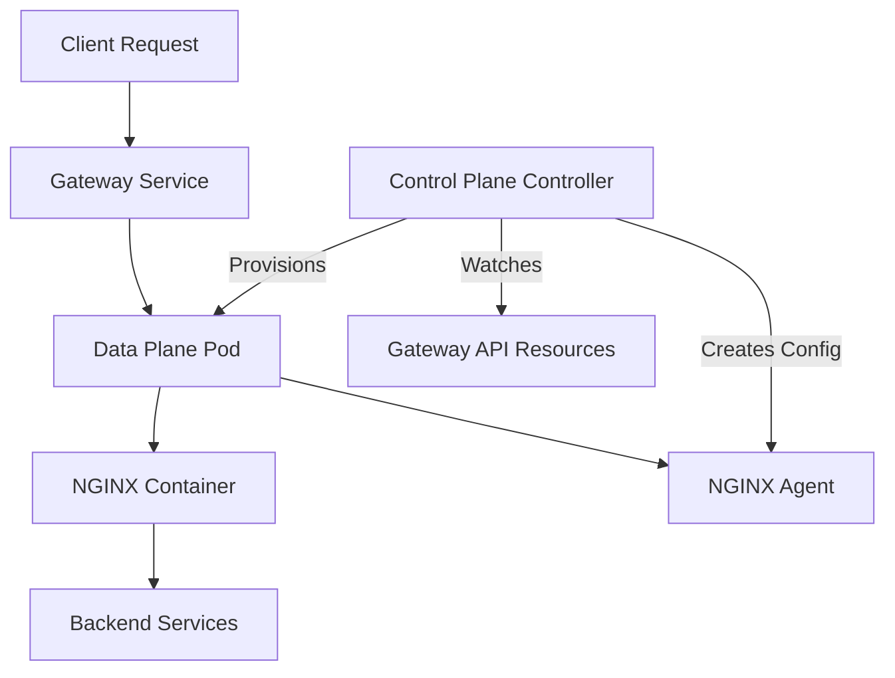
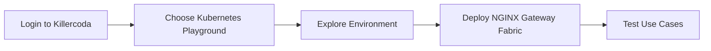
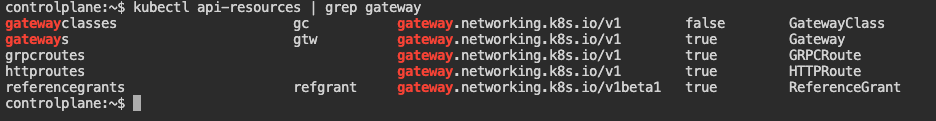
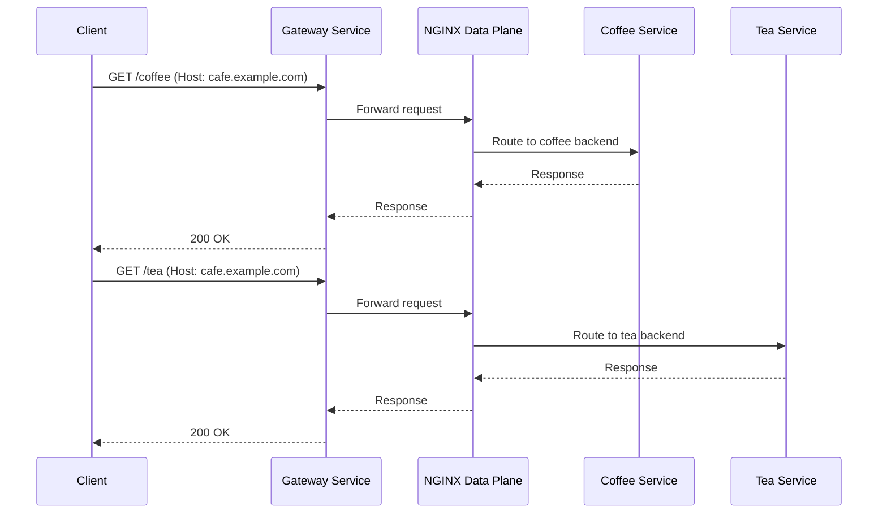
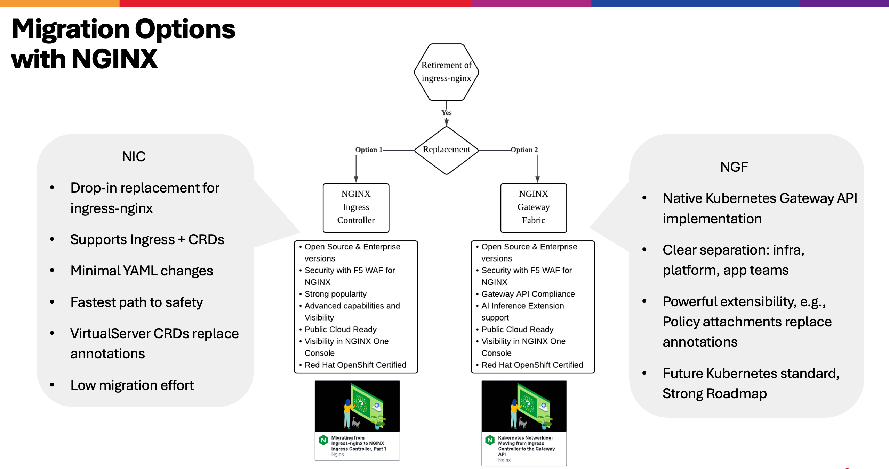
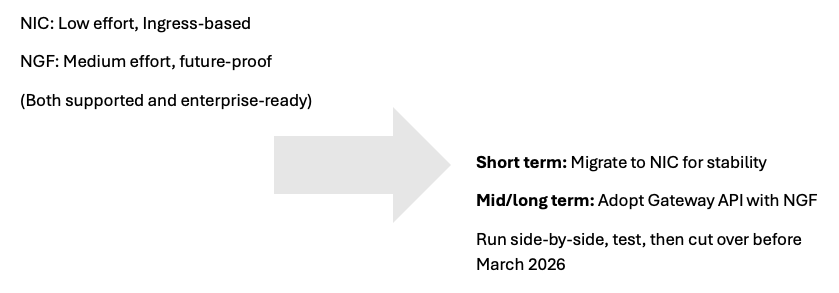

# NGINX Gateway Fabric Lab Guide

A comprehensive hands-on guide to understanding and implementing the Kubernetes Gateway API with NGINX Gateway Fabric.

[](https://github.com/nginx/nginx-gateway-fabric)
[](https://gateway-api.sigs.k8s.io/)
[](LICENSE)

## 📚 What You'll Learn

By the end of this guide, you will have mastered:

- ✅ Understanding the Kubernetes Gateway API and its advantages over Ingress
- ✅ Key concepts and architecture of the Gateway API
- ✅ Practical implementation with NGINX Gateway Fabric
- ✅ Working with Gateway API resources (GatewayClass, Gateway, HTTPRoute)
- ✅ Implementing path-based routing and traffic management

---

## 📖 Table of Contents

- [Introduction](#introduction)
- [Architecture](#architecture)
- [Installation](#installation)
- [Testing Use Cases](#testing-use-cases)
- [FAQ](#faq)
- [Further Reading](#further-reading)

---


## Introduction

### The Gateway API: A Paradigm Shift in Kubernetes Traffic Management

Kubernetes has become the foundation for cloud-native applications, but managing and routing traffic within clusters remains challenging. The traditional Ingress resource, while helpful for exposing services, has shown significant limitations:

- **Loosely defined specifications** leading to controller-specific behaviors
- **Annotation overload** making configurations complex and unportable
- **Limited support** for advanced deployment patterns (canary, blue-green releases)
- **Vendor lock-in** through proprietary extensions and features

### Enter the Gateway API

The Kubernetes Gateway API is a new, standards-based approach to service networking that addresses these limitations by providing:

- **Greater flexibility** with role-oriented design
- **Comprehensive feature set** for modern traffic management
- **Built-in support** for TLS offloading, traffic splitting, and service mesh integration
- **Clear separation** between platform engineers, developers, and security teams

> **💡 Key Concept**: Just like Ingress controllers, the Gateway API separates concerns:
> 
> - **Gateway API Resources**: Define routing rules (Gateway, HTTPRoute, etc.)
> - **Gateway API Controller**: Handles actual traffic routing (not built into Kubernetes)
> 
> You must install a Gateway API controller implementation, such as NGINX Gateway Fabric, to process these resources.

---

## NGINX Gateway Fabric - F5 NGINX Implementaion of Gateway API
NGINX Gateway Fabric provides an implementation of the Gateway API using NGINX as the data plane. The goal of the project is to implement the core Gateway APIs needed to configure an HTTP or TCP/UDP load balancer, reverse proxy, or API gateway for Kubernetes applications.

Built on the Gateway API standard, NGINX Gateway Fabric offers a production-ready solution. It combines the robustness and performance of NGINX with the extensibility of this new standard. It provides consistent traffic management, observability, and security across Kubernetes clusters. Additionally, its integration with NGINX One Console enables centralized control and monitoring in distributed environments.

For a list of supported Gateway API resources and features, see the [Gateway API Compatibility](https://docs.nginx.com/nginx-gateway-fabric/overview/gateway-api-compatibility/) documentation.
---


## Architecture

### NGINX Gateway Fabric Overview

[NGINX Gateway Fabric](https://github.com/nginx/nginx-gateway-fabric) is F5 NGINX's production-ready implementation of the Gateway API standard. It leverages NGINX as the data plane to provide:

- High-performance HTTP and TCP/UDP load balancing
- Reverse proxy and API gateway capabilities
- Centralized management via NGINX One Console
- Full observability and security features

For a complete list of supported resources and features, see the [Gateway API Compatibility](https://docs.nginx.com/nginx-gateway-fabric/overview/gateway-api-compatibility/) documentation.

### Design

NGINX Gateway Fabric uses a split-plane architecture with two controller types:

#### Control Plane Controller
- Deployed when you install NGINX Gateway Fabric
- Watches Gateway API custom resources (Gateway, HTTPRoute, TLSRoute, etc.)
- Translates Gateway API resources into NGINX configurations
- Manages the lifecycle of data plane deployments

#### Data Plane Controller
- Dynamically created when a Gateway resource is provisioned
- Consists of NGINX container with NGINX Agent
- Handles actual traffic routing to services
- Each Gateway gets its own isolated data plane deployment


**NGF Workflow:**

1. Control plane watches Kubernetes API for Gateway resources
2. When a Gateway is created, control plane provisions a new data plane deployment
3. Control plane generates NGINX configuration and pushes to NGINX Agent
4. Data plane routes traffic according to HTTPRoute and other routing rules

Learn more: [Gateway Architecture Documentation](https://docs.nginx.com/nginx-gateway-fabric/overview/gateway-architecture/)
---

## Installation

### Prerequisites

- Kubernetes cluster (1.25+)
- `kubectl` configured to access your cluster
- `helm` (v3.0+) installed

(These pre-requisites are already met in the Environment. We do NOT need to re-install!)

### Environment Setup
This guide uses [Killercoda](https://killercoda.com) for a free, interactive Kubernetes playground.



**Steps:**

1. Navigate to [killercoda.com](https://killercoda.com)

2. Login using your ID provider (Google Or GitHub) 


4. Click **Playgrounds**


5. Select a **Kubernetes Playground** (e.g., One Node 2GB)


6. Wait for environment to initialize


### Explore Your Environment

```bash
# Check cluster nodes
kubectl get nodes -o wide

# List namespaces
kubectl get ns

# View running pods
kubectl get pods -A

# Check API resources
kubectl api-resources | grep gateway

```
At this stage, we should not have the gateway-related API Resources, while other native or installed ones should be present.
Example Output


### Install Gateway API CRDs
```bash
kubectl kustomize "https://github.com/nginx/nginx-gateway-fabric/config/crd/gateway-api/standard?ref=v2.3.0" | kubectl apply -f -
```
<details>
<summary>📦 CRDs - Custom Resource Definitions</summary>

Custom Resource Definitions (CRDs) let you add new API types to Kubernetes so the cluster can understand and manage new objects just like built-in ones.
Gateway API is implemented using CRDs, which brings major advantages—most importantly, each Gateway API release works with the 5 latest Kubernetes minor versions. As a result, you usually don’t need to upgrade your Kubernetes cluster to use the newest Gateway API.
</details>

Let us **verify** gateway CRDs by **re-running** the command: kubectl api-resources
Output should look like:


### Install NGINX Gateway Fabric with Helm
```bash
helm install ngf oci://ghcr.io/nginx/charts/nginx-gateway-fabric --create-namespace -n nginx-gateway
```
<details>
<summary>📦 What the HELM?</summary>

Helm is the package manager for Kubernetes. It allows you to define, install, and upgrade complex Kubernetes applications using reusable charts. In this guide, we use Helm to install NGINX Gateway Fabric with all necessary resources and configurations.

Learn more: [helm.sh](https://helm.sh)
</details>

**Verify the installation:**
```bash
# Check gatewayclass details
kubectl get gatewayclass

# Check Gateway Fabric pods
kubectl get pods -n nginx-gateway
```

Expected output:
```
NAME                                        READY   STATUS    RESTARTS   AGE
ngf-nginx-gateway-fabric-869fb69457-cjl2c   1/1     Running   0          6m30s
```
<mark>This is the Control Plane POD element of the NGF we discussed earlier. At this stage, it is "watching" or looking for the Gateway API resources! We defined the resources by installing the CRDs in the previous stage, but we have not created any resources (i.e., Gateway, HTTPRoute etc.), yet!

We will create those resources, once we have some "backend" apps to route to! 

---
### Deploy Example Application
We deployed the NGINX implementation of Gateway API and now, it is ready to process the API requests relevant to configuring L4 and L7 routing in Kubernetes. Pls check [here](https://gateway-api.sigs.k8s.io/concepts/api-overview/), for a quick overview of these APIs! But before that, we need an example application with multiple routes to which the NGF would route traffic to. 


The application we are going to use in this guide is a simple cafe application comprised of two services - coffee and tea. The initial objective is to route all traffic to hostname **cafe.example.com** to one of these services based on URI Parameters **/coffee** OR **/tea** - also known as **Path-Based Routing**.

Let us deploy the example application: 
```yaml
kubectl apply -f - <<EOF
apiVersion: apps/v1
kind: Deployment
metadata:
  name: coffee
spec:
  replicas: 1
  selector:
    matchLabels:
      app: coffee
  template:
    metadata:
      labels:
        app: coffee
    spec:
      containers:
      - name: coffee
        image: nginxdemos/nginx-hello:plain-text
        ports:
        - containerPort: 8080
---
apiVersion: v1
kind: Service
metadata:
  name: coffee
spec:
  ports:
  - port: 80
    targetPort: 8080
    protocol: TCP
    name: http
  selector:
    app: coffee
---
apiVersion: apps/v1
kind: Deployment
metadata:
  name: tea
spec:
  replicas: 1
  selector:
    matchLabels:
      app: tea
  template:
    metadata:
      labels:
        app: tea
    spec:
      containers:
      - name: tea
        image: nginxdemos/nginx-hello:plain-text
        ports:
        - containerPort: 8080
---
apiVersion: v1
kind: Service
metadata:
  name: tea
spec:
  ports:
  - port: 80
    targetPort: 8080
    protocol: TCP
    name: http
  selector:
    app: tea
EOF
```

**Verify deployment:**

```bash
kubectl get pods,svc
```

Expected output:
```
NAME                          READY   STATUS    RESTARTS   AGE
pod/coffee-5b9c74f9d9-xxxxx   1/1     Running   0          30s
pod/tea-859766c68c-xxxxx      1/1     Running   0          30s

NAME                 TYPE        CLUSTER-IP      EXTERNAL-IP   PORT(S)   AGE
service/coffee       ClusterIP   10.100.139.53   <none>        80/TCP    30s
service/tea          ClusterIP   10.103.46.146   <none>        80/TCP    30s
```

---

## Testing Use Cases

### Use Case 1: Basic HTTP Routing

Create a Gateway and HTTPRoute to expose the cafe application:

```yaml
kubectl apply -f - <<EOF
apiVersion: gateway.networking.k8s.io/v1
kind: Gateway
metadata:
  name: cafe-gateway
spec:
  gatewayClassName: nginx
  listeners:
  - name: http
    port: 80
    protocol: HTTP
    hostname: "*.example.com"
EOF
```

**Verify Gateway provisioning:**

```bash
# Check Gateway status
kubectl get gateway cafe-gateway

# Verify data plane pod was created
kubectl get pods
```
You should see a new pod named `cafe-gateway-nginx-xxxxx`.
<mark> This is the Data Plane element we discussed earlier! The Control Plane was "waiting" for the Gateway object, which it now found and dynamically deployed this NGINX Proxy POD.  

---
Let us inspect further into the Gateway object we just created! This is **useful for debugging**, as the elements in the status section contain important indications, like:

<mark>Did the controller accept this Gateway?  
<mark>Is it fully programmed into the underlying data plane (NGINX in this case)?  
<mark>Are the listeners valid and ready?  
<mark>Are any routes attached yet?  
<mark>Are references valid and conflict-free?

```bash
controlplane:~$ kubectl get gateway cafe-gateway
NAME           CLASS   ADDRESS   PROGRAMMED   AGE
cafe-gateway   nginx             True         13s
controlplane:~$ kubectl describe gateway cafe-gateway
Name:         cafe-gateway
Namespace:    default
Labels:       <none>
Annotations:  <none>
API Version:  gateway.networking.k8s.io/v1
Kind:         Gateway
Metadata:
  Creation Timestamp:  2025-12-09T17:00:01Z
  Generation:          1
  Resource Version:    9376
  UID:                 33802101-929b-412c-b229-e657f4f0d4b7
Spec:
  Gateway Class Name:  nginx
  Listeners:
    Allowed Routes:
      Namespaces:
        From:  Same
    Hostname:  *.example.com
    Name:      http
    Port:      80
    Protocol:  HTTP
Status:
  Conditions:
    Last Transition Time:  2025-12-09T17:00:01Z
    Message:               Gateway is accepted
    Observed Generation:   1
    Reason:                Accepted
    Status:                True
    Type:                  Accepted
    Last Transition Time:  2025-12-09T17:00:01Z
    Message:               Gateway is programmed
    Observed Generation:   1
    Reason:                Programmed
    Status:                True
    Type:                  Programmed
  Listeners:
    Attached Routes:  0
    Conditions:
      Last Transition Time:  2025-12-09T17:00:01Z
      Message:               Listener is accepted
      Observed Generation:   1
      Reason:                Accepted
      Status:                True
      Type:                  Accepted
      Last Transition Time:  2025-12-09T17:00:01Z
      Message:               Listener is programmed
      Observed Generation:   1
      Reason:                Programmed
      Status:                True
      Type:                  Programmed
      Last Transition Time:  2025-12-09T17:00:01Z
      Message:               All references are resolved
      Observed Generation:   1
      Reason:                ResolvedRefs
      Status:                True
      Type:                  ResolvedRefs
      Last Transition Time:  2025-12-09T17:00:01Z
      Message:               No conflicts
      Observed Generation:   1
      Reason:                NoConflicts
      Status:                False
      Type:                  Conflicted
    Name:                    http
    Supported Kinds:
      Group:  gateway.networking.k8s.io
      Kind:   HTTPRoute
      Group:  gateway.networking.k8s.io
      Kind:   GRPCRoute
Events:       <none>
```
### Use Case 2: Path-Based Routing

Route traffic to different services based on URL paths:

```yaml
kubectl apply -f - <<EOF
apiVersion: gateway.networking.k8s.io/v1
kind: HTTPRoute
metadata:
  name: cafe-routes
spec:
  parentRefs:
  - name: cafe-gateway
  hostnames:
  - "cafe.example.com"
  rules:
  - matches:
    - path:
        type: PathPrefix
        value: /coffee
    backendRefs:
    - name: coffee
      port: 80
  - matches:
    - path:
        type: PathPrefix
        value: /tea
    backendRefs:
    - name: tea
      port: 80
EOF
```

**Test the routing:**

```bash
# Using NodePort (Killercoda)
GATEWAY_PORT=$(kubectl get svc cafe-gateway-nginx -o jsonpath='{.spec.ports[0].nodePort}')

# Test coffee endpoint
curl http://localhost:${GATEWAY_PORT}/coffee -H "Host: cafe.example.com"

# Test tea endpoint
curl http://localhost:${GATEWAY_PORT}/tea -H "Host: cafe.example.com"
```

Expected response:
```
Server address: 10.244.0.5:8080
Server name: coffee-5b9c74f9d9-xxxxx
...
```

### Traffic Flow Diagram


---
<mark>This is Installation and Basic Testing.   

<mark> Coming UP:  


1. [Basic Use Cases](https://github.com/nginx/nginx-gateway-fabric/tree/main/examples) and [how-to-Guides](https://docs.nginx.com/nginx-gateway-fabric/traffic-management/)    


2. [Advanced Use Cases](https://docs.nginx.com/nginx-gateway-fabric/how-to/) and [AI-Inference-Extensions](https://docs.nginx.com/nginx-gateway-fabric/how-to/gateway-api-inference-extension/)    

---
# Where to Find More
---
[NGF GitHub Repo](https://github.com/nginx/nginx-gateway-fabric)

[NGF Example Use Cases with Configurations](https://github.com/nginx/nginx-gateway-fabric/tree/main/examples)

[Understanding Gateway API Split Architecture: Control Plane vs. Data Plane](https://blog.nginx.org/blog/understanding-gateway-api-split-architecture-control-plane-vs-data-plane)

[What’s New in F5 NGINX Gateway Fabric 2.3.0](https://blog.nginx.org/blog/whats-new-in-f5-nginx-gateway-fabric-2-3-0)

[Kubernetes Networking: Moving from Ingress Controller to the Gateway API](https://blog.nginx.org/blog/kubernetes-networking-ingress-controller-to-gateway-api)
[Modern Deployment and Security Strategies for Kubernetes with NGINX Gateway Fabric](https://community.f5.com/kb/technicalarticles/modern-deployment-and-security-strategies-for-kubernetes-with-nginx-gateway-fabr/343305)
[5 Things to Know About NGINX Gateway Fabric](https://blog.nginx.org/blog/5-things-to-know-about-nginx-gateway-fabric)
[5 Reasons to Try the Kubernetes Gateway API](https://blog.nginx.org/blog/5-reasons-to-try-the-kubernetes-gateway-api)
[How NGINX Gateway Fabric Implements Complex Routing Rules](https://blog.nginx.org/blog/how-nginx-gateway-fabric-implements-complex-routing-rules)
[NGINX Gateway Fabric Supports the Gateway API Inference Extension](https://blog.nginx.org/blog/ngf-supports-gateway-api-inference-extension)

## FAQ

### My Ingress-nginx Controller In PROD Is Going EOL in March 2026, what are my migration options with F5 NGINX?
F5 NGINX gives you **two paths** forward, and the right choice depends on your timeline and how ready you are to embrace the new Gateway API standard.


**Option 1:** If you're running the community controller today and need a supported replacement without rewriting all your configs, NGINX Ingress Controller (NIC) is your answer. It's built and maintained by F5's dedicated NGINX team, you get continuous security updates, feature enhancements, and access to enterprise support if you need it. Most of your existing Ingress resources will work as drop-in replacements. For advanced features that currently rely on annotations (rate limiting, authentication, Blue-Green deployments), NIC offers Custom Resources like VirtualServer and VirtualServerRoute. These give you the same capabilities but with proper validation and type safety instead of annotation soup.

**Option 2:** The forward-looking option - embracing Gateway API! As we explored in this guide, NGINX Gateway Fabric (NGF) is F5's native and comprehensive implementation of the Kubernetes Gateway API.

***So What Should I Choose for Production!*** If you need to migrate quickly and can't afford disruption, start with NIC. Once you're stable, you can pilot NGF in dev/staging and plan a gradual transition. If you're building greenfield clusters or ready to invest in the future standard now, NGF is the better long-term bet.


### How Is NGINX Gateway Fabric Different from NGINX Ingress Controller?
F5 NGINX Ingress Controller implements the Ingress API specification to deliver core functionality, using custom annotations, CRDs, and NGINX Ingress resources for expanded capabilities. NGINX Gateway Fabric conforms to the Gateway API specification, simplifies implementation, and aligns better with the organizational roles that deal with service networking configurations.

The following table compares the key high‑level features of the standard Ingress API, NGINX Ingress Controller with CRDs, and Gateway API to illustrate their capabilities.
### NGINX Gateway Fabric vs NGINX Ingress Controller

NGINX Gateway Fabric is built on the Gateway API specification, while NGINX Ingress Controller implements the Ingress API. Here's how they compare:

| Feature | Ingress API | NGINX Ingress + CRDs | Gateway API |
|---------|-------------|---------------------|-------------|
| **Role-oriented design** | ❌ | ⚠️ Partial | ✅ |
| **Traffic splitting** | ❌ | ✅ (via annotations) | ✅ (native) |
| **Cross-namespace routing** | ❌ | ❌ | ✅ |
| **Header-based matching** | ❌ | ✅ (via snippets) | ✅ (native) |
| **Weighted backend services** | ❌ | ✅ (custom CRD) | ✅ (native) |
| **Multiple protocols** | ⚠️ Limited | ✅ | ✅ |
| **Portable configuration** | ⚠️ Limited | ❌ | ✅ |

**Note**: NGINX Ingress Controller remains a mature, production-ready solution and is not being replaced. Choose based on your specific use case and requirements.


### Is NGINX Gateway Fabric Going to Replace NGINX Ingress Controller?
NGINX Gateway Fabric is not replacing NGINX Ingress Controller. Rather, it is an emerging technology based on the first generally available release of the Gateway API specification. NGINX Ingress Controller is a mature, stable technology used in production by many customers. It can be tailored for specific use cases through custom annotations and CRDs. For example, to implement the role‑based approach, NGINX Ingress Controller uses NGINX Ingress resources, including VirtualServer, VirtualServerRoute, TransportServer, and Policy.

We don’t expect NGINX Gateway Fabric to replace NGINX Ingress Controller any time soon – if that transition does happen, it’s likely to be years away. NGINX Ingress Controller will continue to play a critical role in managing north‑south network traffic for a diverse variety of environments and use cases, including load balancing, traffic limiting, traffic splitting and security.

### Is NGINX Gateway Fabric an API Gateway?
While it’s reasonable to think something named “Gateway API” is an “API gateway”, this is not the case. As discussed in How Do I Choose? API Gateway vs. Ingress Controller vs. Service Mesh, “API gateway” describes a set of use cases that can be implemented via different types of proxies – most commonly an ADC or load balancer and reverse proxy, and increasingly an Ingress controller or service mesh. That said, much like NGINX Ingress Controller, NGINX Gateway Fabric can be used for API gateway use cases, including routing requests to specific microservices, implementing traffic policies, and enabling canary and blue‑green deployments. This release is focused on processing HTTP/HTTPS traffic. More protocols and use cases are planned for future releases.

### How Do I Get Started with NGINX One?
Ready to try this exciting new technology? Get the release of NGINX Gateway Fabric. For deployment instructions, see the README.

For detailed information on the Gateway API specifications, refer to the Kubernetes Gateway API documentation.

```text
We encourage you to submit feedback, feature requests, use cases, and any other suggestions so that we can help you solve your challenges and succeed. Please share your feedback at our GitHub repo.
```
